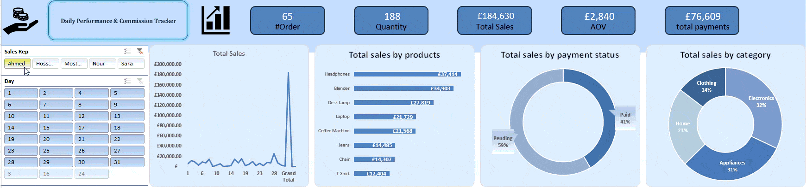

# Sales Representative Performance & Commission Tracker

An interactive Excel dashboard for tracking sales performance and commissions.

## 📊 Overview

This operational Excel dashboard solves the common problem sales representatives face when tracking their performance and commissions. It automatically separates booked sales from collected sales, providing clear visibility into actual performance and earned commissions.

## ✨ Key Features

- **Automatic Commission Calculation:** Separates paid sales (eligible for commission) from pending sales
- **Interactive Filters:** Filter by sales rep name and time period using slicers
- **Real-time Dashboard:** Visual charts and metrics update instantly
- **Easy Data Updates:** Refresh dashboard with one click when new data is added
- **Performance Tracking:** Monitor individual and team performance

## 🛠️ Built With

- **Microsoft Excel** (2013 or newer)
- **Excel Features Used:**
  - Pivot Tables & Pivot Charts
  - Slicers for interactive filtering
  - Logical Formulas (IF, SUMIF)
  - Data Validation
  - Conditional Formatting

## 🚀 Quick Start

### Prerequisites
- Microsoft Excel (2013 or newer version)

### Installation
1. Download the `Sales_Rep_Performance_Dashboard.xlsx` file
2. Open with Microsoft Excel
3. Enable editing if prompted

## 💻 How to Use

### For Sales Representatives:
1. Go to the **"Dashboard"** tab
2. Use slicers to select your name and desired time period
3. View your personal performance metrics and due commissions

### For Managers:
1. Use the same **"Dashboard"** tab
2. Filter by different sales reps or time periods
3. Compare team performance and track sales trends

### Adding New Data:
1. Go to the **"Data"** tab
2. Add new sales records at the bottom of the table
3. Refresh the pivot tables (Data → Refresh All)
4. Return to Dashboard to see updated results

## 📈 Dashboard Components

- **Sales Overview:** Total booked vs collected sales
- **Commission Calculator:** Real-time commission calculations
- **Performance Metrics:** Key performance indicators for each rep
- **Sales Trends:** Monthly/quarterly sales trends
- **Product Performance:** Most profitable products and services

## 🏗️ File Structure

### Excel File Structure:
- **Dashboard Tab:** Main interactive dashboard with charts and slicers
- **Data Tab:** Raw sales data input area
- **Analysis Tab:** Pivot tables and calculations
- **Settings Tab:** Commission rates and configuration

## 🔧 Customization

You can easily customize:
- Commission rates in the Settings tab
- Sales targets and goals
- Time periods for reporting
- Additional performance metrics

## 🤝 Contributing

Feel free to fork this project and submit pull requests for:
- Additional dashboard features
- Improved calculations
- Enhanced visualizations
- New performance metrics

## 📞 Support

For questions or support regarding this dashboard, please open an issue in this repository.
